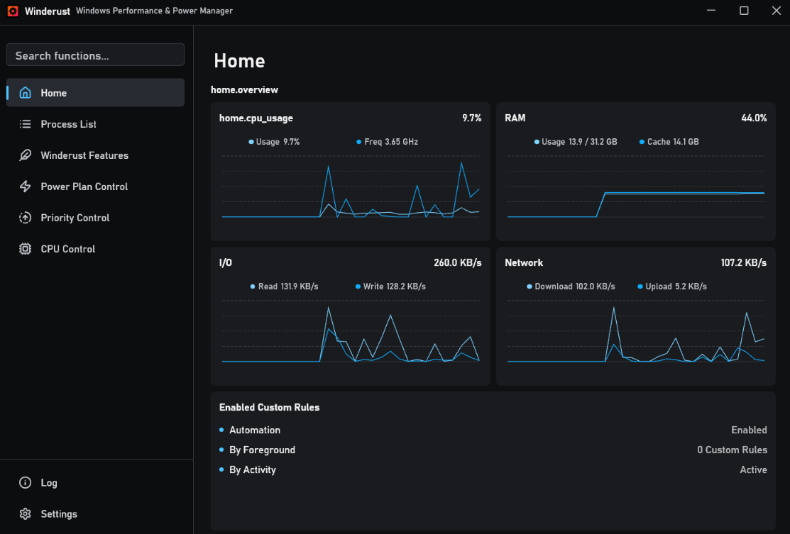

> [!WARNING]  
> Alpha state, expects things to be not so perfect or nicely handled.

# Winderust

Windows Performance & Power Manager. A system engine to improve your Windows experience.



## Features

- Adaptive Engine that automatically adjust background process resource
- Automatic power plan switching modules
- CPU/GPU/Memory/IO etc. Priority Control
- Smart memory trimming for background process
- iOS inspired background app suspension
- etc. 


## Benchmark
- Although I do benchmarks for the presets, but the base entry is still too small for a nice experience.
- This is adaptive engine benchmark results, mostly sacrificing background jobs for smoother foreground jobs.
Benchmark are in [`benchmark/`](benchmark/README.md).

## Run/Build it yourself
- [Prerequisites](https://rustup.rs)

Debug build
```powershell
cargo run
```

Release build
```powershell
cargo build --release
```

The executable is written to `target\*`


## Contributions

Before contributing, run:

```powershell
cargo fmt -- --check
cargo clippy --locked --all-targets -- -D warnings
cargo test --locked
```

See 
- [CONTRIBUTING.md](CONTRIBUTING.md)
- [SECURITY.md](SECURITY.md).

## License

Copyright (C) 2026 Tatsh Siow.
License under [GPLv3.0](LICENSE).
