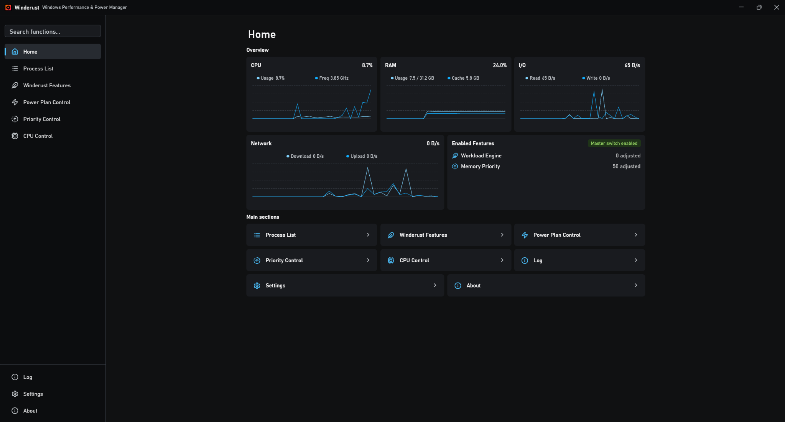

> [!IMPORTANT]
> Join the [Winderust Discord community](https://discord.com/invite/M7nctFZUxX).

> [!WARNING]  
> Alpha state, expects things to break,imperfect or not nicely handled.

# Winderust

Windows Performance & Power Manager. A system engine to improve your Windows experience.



## Download

[Download the latest release](https://github.com/TatshSiow/Winderust/releases).

## Features

- Adaptive Engine that automatically adjust background process resource
- Automatic power plan switching modules
- CPU/GPU/Memory/IO etc. Priority Control
- Smart memory trimming for background process
- iOS inspired background app suspension
- etc. 

## Documentation

- [Architecture](docs/architecture.md)
- [Adaptive Engine implementation](docs/adaptive-engine-implementation.md)
- [Release checklist](docs/release-checklist.md)

## Benchmark

Adaptive Engine benchmarks compare foreground responsiveness, retained background throughput,
and package power on specific hardware. See [`benchmark/`](benchmark/README.md) for reports and
methodology limits.

## Run/Build it yourself
- [Prerequisites](https://rustup.rs)

Debug build
```powershell
cargo run
```

Release build
```powershell
cargo build --release
```

The executable is written to `target\*`


## Contributions

Before contributing, run:

```powershell
cargo fmt -- --check
cargo clippy --locked --all-targets -- -D warnings
cargo test --locked
```

See 
- [CONTRIBUTING.md](CONTRIBUTING.md)
- [SECURITY.md](SECURITY.md).

## License

Copyright (C) 2026 Tatsh Siow.
Licensed under [GPL-3.0-only](LICENSE).
